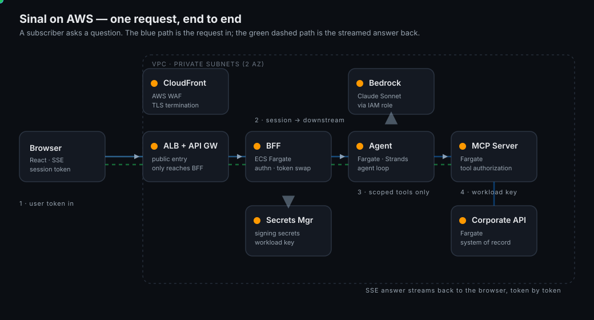

# Sinal — Agentic Platform

A conversational support platform for the fictional carrier **Onda Telecom**. A customer
asks a question in plain language; an agent answers it by calling corporate capabilities
exposed as **tools over MCP** — never by touching the business systems directly, and
never beyond what that customer is allowed to see.

> All data here is fictional. "Onda Telecom" does not exist and no real subscriber data
> is used anywhere in this repository.

**Live demo:** <https://app.sinal.brandaodeveloper.com.br> — sign in with `marina` /
`demo1234` and ask about an invoice, data usage, a plan, roaming or a ticket.



## The idea in one line

> The agent may only do, for a given user, what that user is allowed to do — and the
> proof of that lives in code, outside the prompt and outside the probabilistic decision
> of the model.

Everything here serves that rule. It is what makes this an agentic platform and not a
chatbot.

## Architecture

```
React (SSE) -> BFF / gateway -> Agent (triage + specialists) -> MCP Server -> Corporate API
   TS             Node/TS            Python/Strands              Node/TS       Python/FastAPI
                                          |                          |
                                     Redis (state)            RAG vector store
```

Each layer is its own process in its own runtime, reached over HTTP, so coupling between
them is impossible by construction.

| Service | Stack | Role |
|---|---|---|
| [`apps/web`](apps/web) | React + TypeScript | WhatsApp-style chat, streams the answer |
| [`apps/bff`](apps/bff) | Node + TypeScript | gateway: authn, token exchange, rate limit, SSE proxy |
| [`apps/agent`](apps/agent) | Python + Strands Agents | agent loop, A2A triage, session memory |
| [`apps/mcp-server`](apps/mcp-server) | Node + TypeScript | MCP Server (Streamable HTTP), tool authorization, RAG |
| [`apps/api-telecom`](apps/api-telecom) | Python + FastAPI | corporate system of record |

Three identities, never conflated — **user** (session JWT), **agent** (the downstream
token it forwards, no credential of its own), **tool** (workload key). A stolen session
token cannot be replayed against the MCP server: wrong audience, wrong key, minutes to
live.



## What it does

- **Nine tools over MCP**, discovery filtered by the caller's scopes — the model never
  sees a capability the user cannot use.
- **A2A**: a triage step routes each turn to a focused specialist (billing / technical /
  knowledge) with its own prompt and a subset of tools — least privilege at the agent
  layer, shown live in the UI ("Billing agent used list_invoices").
- **RAG**: a `search_knowledge_base` tool retrieves help-article passages from a vector
  store by cosine similarity with MMR, so policy answers are grounded, not invented.
- **Streaming** end to end over SSE, token by token, with the per-turn cost shown.
- **Human-in-the-loop**: a ticket is never opened without explicit confirmation.

## Scale and resilience

- **Redis-backed** rate limit and session state, shared across replicas (falls back to
  in-memory for a single replica / local runs).
- **Autoscaling**: a HorizontalPodAutoscaler per service on k3s; ECS Service Auto Scaling
  on the AWS target.
- **Resilience** in the MCP client: per-attempt timeout, retry with backoff (idempotent
  GETs only), circuit breaker, and a short-TTL read cache.

## Run it locally

Requirements: Node 20+, Python 3.12, `uv`, Docker.

```bash
cp .env.example .env
docker compose -f infra/docker/compose.yaml up -d --build
# web on :5173, gateway on :8080
```

Demo accounts (password `demo1234`): `marina`, `rafael` (subscribers), `agent-smith`
(support desk, holds `customer:any`).

## Tests and gates

| Suite | Command | Count |
|---|---|---|
| Corporate API | `cd apps/api-telecom && .venv/bin/python -m pytest` | 25 |
| MCP Server | `cd apps/mcp-server && npm test` | 71 |
| Agent | `cd apps/agent && .venv/bin/python -m pytest` | 55 |
| Gateway | `cd apps/bff && npm test` | 39 |
| Web | `cd apps/web && npm test` | 34 |
| Evals | `cd evals && .venv/bin/python -m pytest` | 18 |

Three gates run in CI ([`.github/workflows/ci.yml`](.github/workflows/ci.yml)):

- **Regression gate** — the golden suite (`evals/`) fails the build if a blessed case
  regresses. One mechanism covers a change in prompt, tool or model.
- **Live red team** — `security/redteam/attack.mjs` fires 24 real attacks at the booted
  stack and must refuse every one (**24/24**).
- **No-mock end to end** — `node infra/smoke/full-chain.mjs` runs BFF -> agent -> MCP ->
  API against the real stack (**14/14**).

```bash
node infra/smoke/full-chain.mjs              # BFF -> agent -> MCP -> API, no mocks
node security/redteam/attack.mjs             # live adversarial red team
cd evals && python -m sinal_evals.cli gate   # regression gate
```

## Documentation

| Document | What it answers |
|---|---|
| [docs/ARCHITECTURE.md](docs/ARCHITECTURE.md) | how the layers separate, the three identities, request flow |
| [docs/SECURITY.md](docs/SECURITY.md) | inbound/outbound auth, tool authorization, keeping rules out of the prompt |
| [docs/OBSERVABILITY.md](docs/OBSERVABILITY.md) | one correlation id across the chain, cost as a signal, CloudWatch/OTel |
| [docs/DEPLOY.md](docs/DEPLOY.md) | AWS topology, k3s<->AWS parity, autoscaling, rollback, cost |
| [docs/RISKS.md](docs/RISKS.md) | the real risks and what holds each one down |
| [docs/adr/](docs/adr) | the seven decisions of record |
| [security/FINDINGS.md](security/FINDINGS.md) | red-team findings and their fix status |

## Repository layout

```
apps/            web, bff, agent, mcp-server, api-telecom
packages/        shared OpenAPI contract
evals/           golden suite, runner, regression gate
security/        red-team harness and findings
infra/           docker compose, k8s manifests, terraform (AWS), smoke tests
docs/            architecture, security, observability, deploy, risks, ADRs, diagrams
```

Secrets are never committed. `.env` is gitignored; every service refuses to boot outside
`dev` while a secret still holds its development default, and the AWS target reads
secrets from Secrets Manager via an IAM role. The public demo runs a deterministic
`scripted` model provider (no key, zero cost); `anthropic` and `bedrock` run the same
code against a real model.
